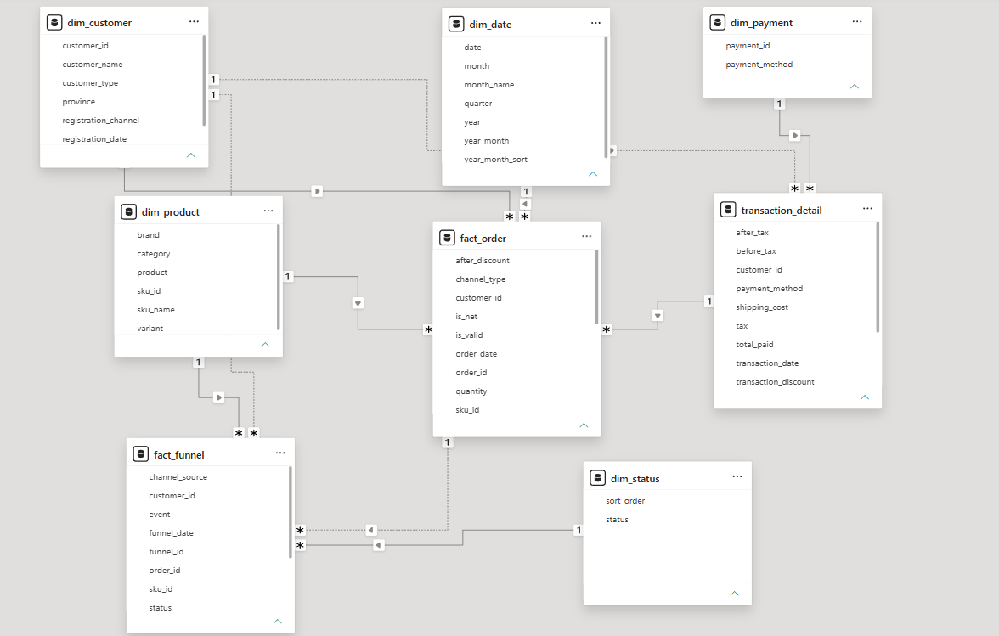
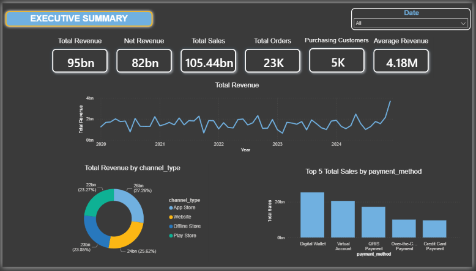
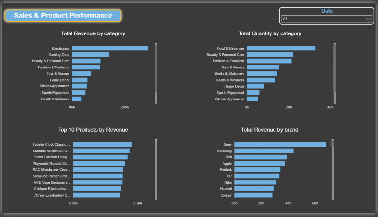
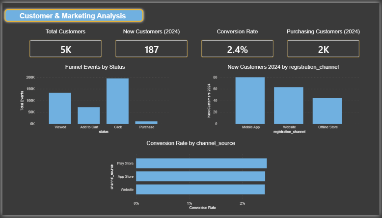

# E-commerce Business Performance Analysis — Power BI

## Project Overview

This project analyzes e-commerce business performance using Power BI, focusing on data modeling, DAX measures, and interactive dashboard development.

The project uses an e-commerce dataset previously analyzed using PostgreSQL and Looker Studio. This project approaches the same dataset from a different perspective by developing a structured data model, applying a star schema design, creating DAX measures, and building an interactive Power BI dashboard.

The analysis covers sales and revenue performance, product performance, customer metrics, and marketing funnel performance.

## Business Questions

This project aims to answer the following business questions:

- How does revenue change over time?
- Which sales channels contribute the most revenue?
- Which payment methods generate the highest sales?
- Which product categories and brands generate the highest revenue?
- Which products contribute the most to overall revenue?
- How many customers are purchasing and how many new customers are acquired?
- How are marketing funnel events distributed across different stages?
- What is the conversion rate by channel source?

## Dataset & Data Preparation

The project uses an e-commerce dataset containing order, transaction, customer, product, payment, and marketing funnel data.

Data preparation was performed using PostgreSQL before importing the data into Power BI. The preparation process included data cleaning, validation, transformation, and structuring the data into tables required for the Power BI data model.

The prepared data was then imported into Power BI and organized into fact and dimension tables to support analytical reporting and DAX calculations.

## Data Model

The Power BI data model is designed around a star schema structure, with fact tables containing transactional and event data and dimension tables providing descriptive attributes for analysis.

### Fact Tables

- `fact_order` — contains SKU-level order data, including quantity, revenue, order date, sales channel, and transaction status indicators. The grain is one row per SKU in an order.
- `fact_funnel` — contains marketing funnel event data, including funnel status, channel source, customer, product, and funnel date.
- `transaction_detail` — contains detailed transaction and payment information, including total paid, tax, shipping cost, and payment method.

### Dimension Tables

- `dim_product` — contains product, category, brand, variant, and SKU information.
- `dim_customer` — contains customer attributes such as customer type, province, registration channel, and registration date.
- `dim_payment` — contains payment IDs and payment method information.
- `dim_date` — contains date attributes used for time-based analysis.
- `dim_status` — contains funnel status and sort order used to organize funnel stages.

The relationships between these tables allow the model to support filtering, aggregation, and DAX calculations across different areas of the analysis.

## DAX Measures

DAX measures were created to calculate key business metrics used throughout the Power BI dashboard.

The main measures include:

- Total Revenue
- Net Revenue
- Total Sales
- Total Shipping
- Total Tax
- Total Quantity
- Total Orders
- Net Orders
- Average Revenue per Order
- Net Average Revenue per Order
- Total Customers
- Customers with Purchase
- Customers with Purchase 2024
- New Customers 2024
- Total Events
- Total Converted Orders
- Conversion Rate

These measures are used to support KPI cards, revenue trends, sales and product analysis, customer analysis, and marketing funnel analysis.

## Dashboard

The Power BI dashboard consists of three interactive pages:

### 1. Executive Summary

Provides an overview of business performance through key performance indicators, revenue trends, revenue by sales channel, and sales by payment method.

### 2. Sales & Product Performance

Focuses on product and sales performance through revenue and quantity by category, top 10 products by revenue, and revenue by brand.

### 3. Customer & Marketing Analysis

Focuses on customer metrics and marketing funnel performance, including total customers, new customers in 2024, purchasing customers in 2024, funnel events by status, new customers by registration channel, and conversion rate by channel source.

## Tools Used

- PostgreSQL — data preparation and transformation
- Power BI — data modeling, DAX, and interactive dashboard development
- DAX — business metrics and analytical calculations
- GitHub — project documentation and version control
  
## Related Project

This project builds upon a previous analysis of the same e-commerce dataset using PostgreSQL and Looker Studio.

While the previous project focused on SQL-based business analysis and dashboard visualization, this project focuses on data modeling, star schema design, DAX measures, and interactive Power BI dashboard development.

**Previous Project:**  
[ecommerce-business-performance-analysis](https://github.com/shintiabella/ecommerce-business-performance-analysis)
